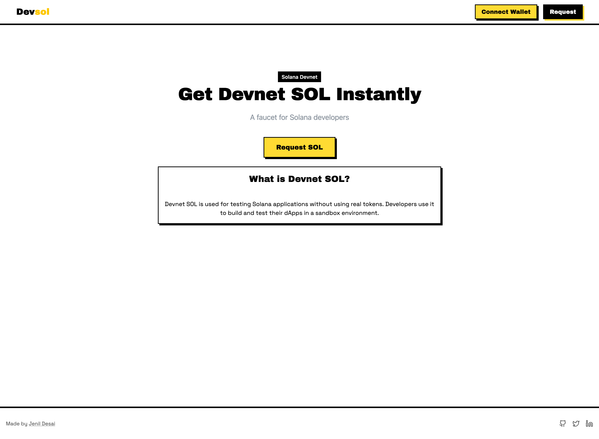
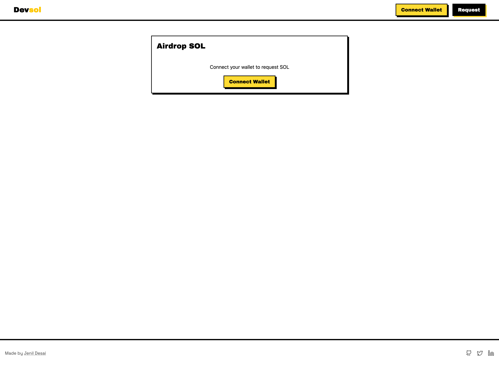
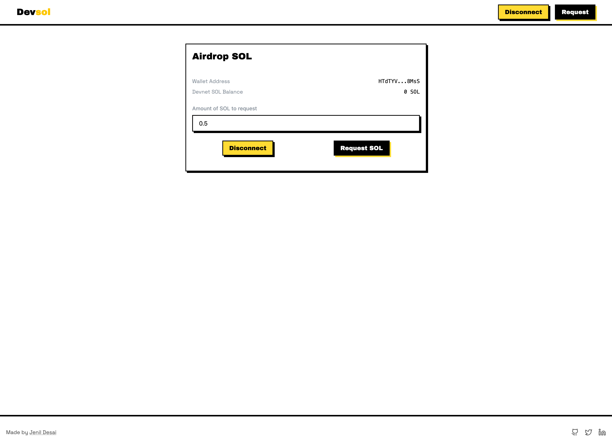

# ⚡ Devsol – Airdrop SOL on Devnet, Effortlessly

**Devsol** is a minimal and secure utility built to airdrop **Solana (SOL)** tokens on the **devnet**, specifically designed for developers, testers, and blockchain learners. It provides a simple interface to connect your wallet, request devnet SOL, and check your balance — all within a clean and modern UI built with Retro UI + Shadcn.

> Perfect for testing Solana smart contracts, building dApps, or experimenting with wallet interactions.

---

## 📑 Table of Contents

1. [Overview](#-overview)
2. [Tech Stack](#-tech-stack)
3. [Packages & Libraries](#-packages--libraries)
4. [Getting Started](#-getting-started)
5. [Setup](#-setup)
6. [Features](#-features)
7. [Demo & Screenshots](#-demo--screenshots)
8. [Acknowledgments](#-acknowledgments)
9. [License](#-license)

---

## 🌟 Overview

Devsol provides a fast and intuitive way to connect your Solana wallet and receive free SOL on the **devnet**, intended solely for development and testing purposes. It helps developers quickly test transactions and interactions in a simulated network without needing real tokens or complicated CLI tools.

---

## 🧠 Tech Stack

| Layer        | Tech                             |
|--------------|----------------------------------|
| Framework    | Next.js (TypeScript)             |
| Styling      | Tailwind CSS + Shadcn + Retro UI |
| Runtime      | Bun.js                           |
| Blockchain   | Solana Devnet                    |

---

## 📦 Packages & Libraries

- `@solana/web3.js` – Solana SDK for JS/TS
- `@solana/wallet-adapter` (base, react, react-ui, wallets)
- `react-hook-form` – Form management
- `@hookform/resolvers` – Integrates with Zod
- `zod` – Type-safe schema validation
- `sonner` – Notification & toast library
- `shadcn/ui` – Modern, accessible component library
- `retro-ui` – Classic retro theme styling

---

## 🚀 Getting Started

> Prerequisites:
- Bun.js (or Node.js)
- Git
- IDE (WebStorm / VS Code / Zed)

---

## ⚙️ Setup

1. Clone the repository:
   ```bash
   git clone https://github.com/Jenil-Desai/devsol.git
   ```

2. Navigate to the project folder:

   ```bash
   cd devsol
   ```

3. Open in your IDE and install dependencies:

   ```bash
   bun install   # or npm/yarn/pnpm
   ```

4. Run the project:

   ```bash
   bun run dev
   ```

---

## 🎯 Features

* 🔌 **Connect Solana Wallet**

  * Supports Phantom and other popular wallets via Wallet Adapter

* 💸 **Airdrop SOL**

  * Instantly airdrop devnet SOL to your connected wallet

* 💰 **Check Balance**

  * View the real-time balance of your wallet on Solana devnet

* 🖼️ **Custom Wallet UI**

  * Clean wallet connection button with Shadcn + Retro theme

---

## 📸 Demo & Screenshots

Live demo: [devsol-tan.vercel.app](https://devsol-tan.vercel.app)

| Landing Page | Request Page Without Wallet Connected | Request Page With Wallet Connected |
|--------------|--------------|--------------|
|  |  |  |

---

## 🙏 Acknowledgments

1. **Harkirat Singh** – Web3 Cohort-3 Assignment Inspiration
2. [Retro UI Documentation](https://www.retroui.dev)
3. [Solana Wallet Adapter Docs](https://github.com/solana-labs/wallet-adapter)
4. [Custom Wallet UI Guide](https://medium.com/@kusalkalingainfo/creating-a-custom-solana-wallet-connect-ui-with-next-js-tailwind-and-shadcn-b9e372dc2ac0)

---

## 📜 License

This project is licensed under the **MIT License**.

---

> Devsol – A developer-first SOL airdropper to power your Web3 builds.
